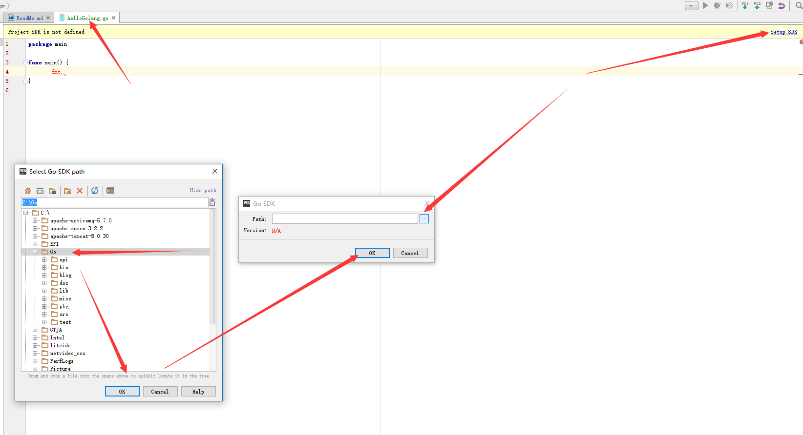

# 第零章 说明
- 本项目针对具有一定开发经验的开发者,不面向初学者.
- golangman中golang表示语言,man表示linux man命令.
- 本文档可任意转载,但必须指明出处且不得删除本说明.
- 如果本文档对你有帮助,请给一颗星.https://github.com/jackhu1990/golangman.

# 第一章 快速开始

## 下载golang安装包
- [google官方地址](https://golang.org/dl/)
- [墙内地址](http://golangtc.com/download)
- 安装后目录结构


## 配置环境变量
- GOROOT
目的是告诉一些其他程序(如IDE)golang安装包安装在哪里

- PATH
目的是可以系统中直接运行go.exe,而无需进入到安装目录

- GOPATH
目的是指定第三方go包的安装目录.
golang的包类似java的jar、c++的lib.golang的包管理类似nodejs的npm、java的maven、c#的nuget.
除了系统自带的一些包,其他包均需要下载.


## 安装IDE
个人喜好,因为我很喜欢WebStorm开发js,所以安装了WebStorm的go插件,个人可自行改变,但根据我试用多个IDE或代码编辑器的情况,强烈推荐WebStorm..
- WebStorm 11以上版本
- 安装 WebStorm使用的go插件
    

## Hello GOLang
- 新建一个hellogolang.go文件
```go
     package main
     import "fmt"

     func main() {
     	fmt.Println("Hello Golang")
     }
```
- WebStorm 11 会要求配置下go目录,按照步骤设置.ps:这好像一个bug.


- 鼠标右键,RUN.


# 第二章 语言只是语言

## 基础数据类型
```go

int8 int16 int32 int64
uint8 uint16...
float32 float64
string
bool

```

## 结构体
```go

type PersonBase struct{
	Name string
	Age int
}
type Boy struct{
	Person PersonBase
	Sex string
}


var person PersonBase

```
type 类似c/c++中 typedef

## 变量定义
- var
```go
var inputCount  uint32
var(
    inputCount  uint32
    outputCount uint32
    errorCount  uint32
)
inputCount = 1024
```
- var简写
```go

inputCount := 1024

```

## 这里应该有指针
```go

    var inputCountP *int
    var person PersonBase
    var personP *PersonBase
    person.Name = "jackhu"
    person.Age = 27
    personP = new(PersonBase)
    personP.Name = "gaofei"
    personP.Age = 27

```

## 常用复合数据类型
```go

a := [...]string   {"one","two"} //array
s := []string      {"one","two"} //slice
m := map[int]string{1:"one", 2:"two"} //map

```
- array和slice

    和c有区别,在Go中，数组是值。
    将一个数组赋予另一个数组会复制其所有元素。so,若将某个数组传入某个函数，它将接收到该数组的一份副本而非指针。
    数组的大小是其类型的一部分。类型 [10]int 和 [20]int 是不同的。
    array是固定分配,不可更改.在详细规划内存布局时，数组是非常有用的，有时还能避免过多的内存分配， 但它们主要用作切片的构件。
    切片保存了对底层数组的引用，若你将某个切片赋予另一个切片，它们会引用同一个数组。 若某个函数将一个切片作为参数传入，则它对该切片元素的修改对调用者而言同样可见， 这可以理解为传递了底层数组的指针。
    简单来说,数组是值,切片类似指针,指向数组.其他遵循值拷贝.


```go

func test(slice []string)(){
	slice[2]="y"
	return
}
func main() {
	s := []string{"1","2","3"}
	s1:= s;
	for i,v:=range s {
		fmt.Println(i, v)
	}
	s1[2]="w";
	for i,v:=range s {
		fmt.Println(i, v)
	}
	test(s1)
	for i,v:=range s {
		fmt.Println(i, v)
	}
}
    0 1
    1 2
    2 3
    0 1
    1 2
    2 w
    0 1
    1 2
    2 y


```

## 条件控制语句
- if
```go
    if i := 10; i < 5 {
        fmt.Print("***********")
    }
```
- switch
- select
- for
```go

    sum := 0
    for i := 0; i < 10; i++ {
        sum += i
    }
	arr :=[...] int {1,2,3,4,5}
	for i,v:= range arr{
		fmt.Println("index:", i, "value:", v)
	}
	m := map[int]string{1:"one", 2:"two"}
	for i,v:= range m{
		fmt.Println("index:", i, "value:", v)
	}
    index: 0 value: 1
    index: 1 value: 2
    index: 2 value: 3
    index: 3 value: 4
    index: 4 value: 5
    index: 1 value: one
    index: 2 value: two

```

## 函数
- 定义
```go

func Add(addA int, addB int) (int){
    result := addA + addB
    return result
}

```
- 两个返回值
```go

func Add(addA int, addB int) (int, error){
    if addA==0 {
        return 0,errors.New("第一个参数不能为0")
    }
    result := addA + addB
    return result,nil
}
func main() {
        fmt.Println("Hello Golang")
        result,err := Add(0,10)
        if err != nil {
            fmt.Println(err)
            return
        }
        fmt.Println(result)
}
    Hello Golang
    第一个参数不能为0

```
- error
error可以假装理解为内置的类型(实际是接口),返回时errors.New("第一个参数不能为0")这样即可.

## 这里没有类吗
- 类函数

- interface
>按照约定，只包含一个方法的接口应当以该方法的名称加上-er后缀或类似的修饰来构造一个施动着名词，如 Reader、Writer、 Formatter、CloseNotifier 等。

## defer
就是javascript中的promise模式,angularjs中的$q服务
这里比他们都要简单,加上defer的语句保证在函数return之后执行.
非常优秀的设计,简化了异常情况下资源释放的问题.比如文件打开,打开后就defer close.这样即使有异常,文件也会被关闭.
```go

file,err:=os.Open(fullPath)
if err!=nil{
    return nil,err
}
defer file.Close()
```

## go

## chan

## make
>内建函数 make(T, args) 的目的不同于 new(T)。它只用于创建切片、映射和信道，并返回类型为 T（而非 *T）的一个已初始化 （而非置零）的值。 出现这种用差异的原因在于，这三种类型本质上为引用数据类型，它们在使用前必须初始化。 例如，切片是一个具有三项内容的描述符，包含一个指向（数组内部）数据的指针、长度以及容量， 在这三项被初始化之前，该切片为 nil。对于切片、映射和信道，make 用于初始化其内部的数据结构并准备好将要使用的值。

## 恐慌panic与恢复recover

# 第三章 从写个工具开始

